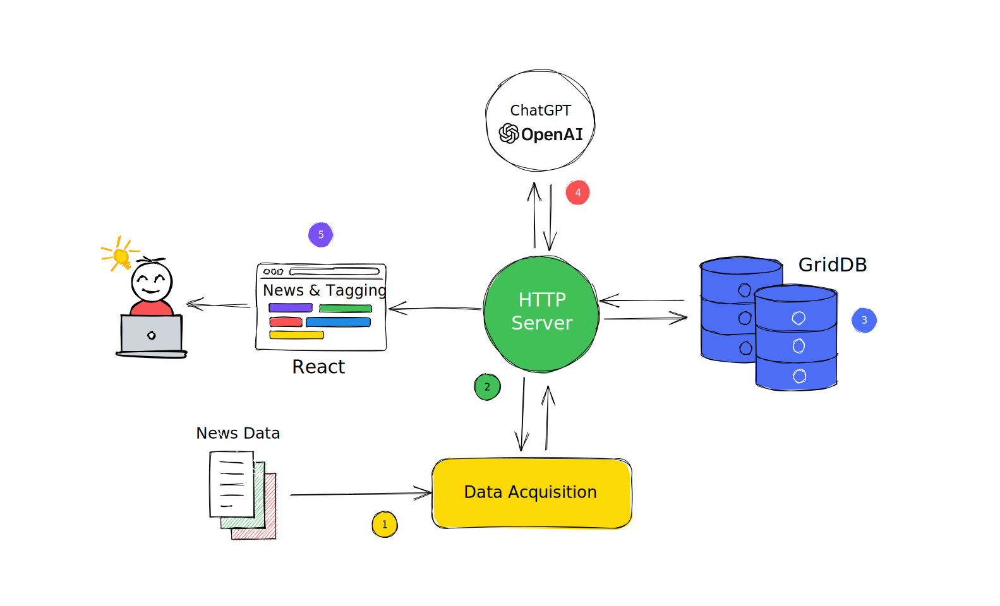

# How to Leverage ChatGPT, Node.js, and GridDB for Powerful News Topic Modelling

News topic modelling is an essential technique in the field of natural language processing (NLP) and machine learning that focuses on automatically identifying, extracting, and categorizing the main topics or themes present in a collection of news articles. By leveraging advanced algorithms and NLP techniques, such as the powerful GPT-3.5 model developed by OpenAI, news topic modelling can effectively analyze and summarize vast amounts of text data in real-time.

News topic modelling plays a crucial role in processing, organizing, and presenting the wealth of information available in the digital news domain. It enhances user experience, supports data-driven decision-making, and contributes to a better understanding of the world's most pressing issues.

In this blog we will build **automated content tagging system**. News topic modelling can streamline the content tagging process by automatically assigning appropriate tags or categories to news based on their extracted topics.

We will use Node.js to process news data and using ChatGPT to analyzing and extracting the topics from the news data. We will use GridDB to store and retriev all the data and displaying to the user.

